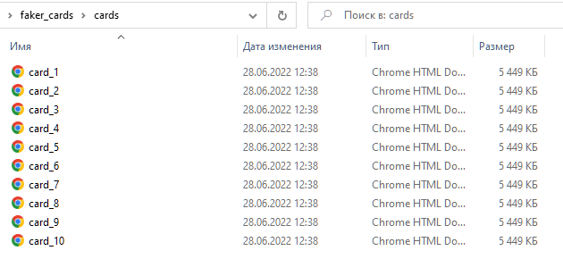
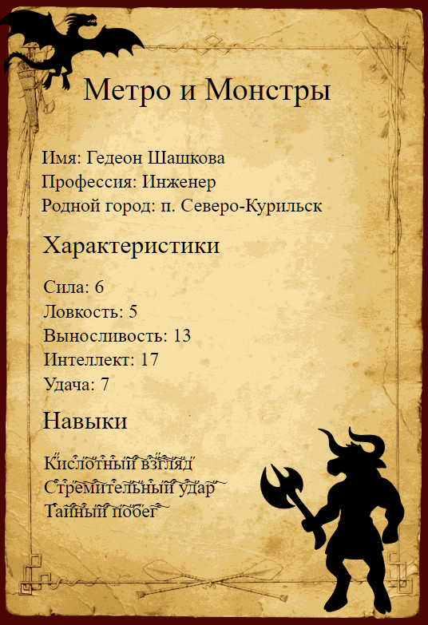

# Генерация карточек для игры в D&D
Используется библиотека faker для генерации данных.<br>

Сгенерированные карточки сохраняются в директории `cards`<br>
Файл шаблона для генерации карточки лежит в директории `src`<br>

## Порядок действий:

1. Скачайте проект:<br>
```commandline
git clone https://github.com/NankuF/generate_cards_with_faker.git
```
2. Создайте виртуальное окружение:<br>
```commandline
python -m venv venv
```
3. Установите зависимости:<br> 
```commandline
pip install -r requirements.txt
```
3. Запустите код в консоли:<br>
```commandline
python generate_cards.py
```
4. Перейдите в директорию cards и откройте сгенерированную карточку.<br>
<br>
<br>